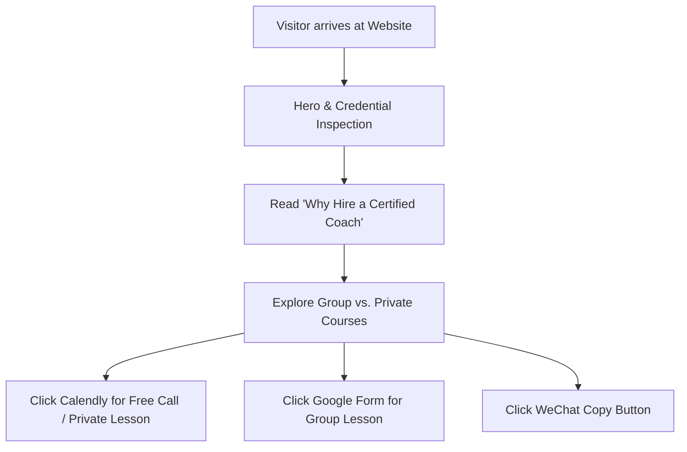

# Product Requirements Document (PRD): Ying Zhang Ski Coaching Website

## 1. Document Control
* **Version:** 2.0
* **Date:** 2026-10-06
* **Author:** Ying Zhang / Antigravity Agent
* **Status:** Approved / Implemented (`index_option3.html`)

---

## 2. Executive Summary & Objectives

### 2.1 Problem Statement
Skiing in the Swiss Alps can be daunting for beginners and intermediate skiers without proper instruction. Self-taught techniques frequently lead to bad posture habits (e.g. leaning back, excessive inner-edge leaning) and elevated injury risks on steep slopes. Prospective students need clear instructor credentials, an engaging value proposition on why certified coaching matters, and straightforward booking pathways.

### 2.2 Product Goals & Objectives
* Establish strong trust and authority by presenting instructor credentials (Austrian Landes 1 / International 2.5 Certified, Zermatt Evolution Ski School background).
* Communicate clear value propositions to first-time skiers regarding safety, fast technique acquisition, and slope management.
* Provide frictionless conversion touchpoints:
  1. 15-minute free discovery calls via Calendly.
  2. One-click WeChat contact (`epflyingzhang`).
  3. Direct registration forms for Adult Group Lessons & Private Coaching.
* Present student social proof (testimonials) and visual proof (Google Drive album link).

### 2.3 Target Audience & Personas
* **Primary:** Expats and Chinese-speaking professionals & students living in Zurich, Lucerne, Zug, and Basel seeking English/Chinese ski instruction.
* **Secondary:** Families seeking custom private lessons for parents & children in top nearby resorts (Stoos, Engelberg, Flumserberg, Andermatt).

---

## 3. Core Features & Functional Requirements

### 3.1 Hero & Credential Highlights
* **Description:** High-impact hero section introducing Ying Zhang with certification badges and resort locations.
* **Functional Requirements:**
  * Displays Landes 1 badge and experience metrics (100+ students).
  * Quick action buttons for Free Discovery Call, WeChat copy, and Course Schedule.

### 3.2 Value Proposition ("Why Hire a Coach?")
* **Description:** Three structured feature cards addressing Safety & Control, Fast Progression, and Local Resort Guidance.

### 3.3 Live Schedule & Slot Availability Banner
* **Description:** Highlight banner emphasizing 2024-2025 season weekend/holiday course availability with link to real-time Google Sheet.

### 3.4 Course Catalog & Booking Options
* **Adult Group Coaching Card:** Focus on budget-friendly, leveled group learning. Buttons for Intro Doc, Schedule Sheet, and Registration Form.
* **Private Coaching Card:** Focus on flexible 1-on-1/family pacing with video analysis. Buttons for Intro Doc and Calendly Booking.

### 3.5 Testimonials & Photo Gallery
* **Description:** 3 testimonial cards featuring real student feedback + link to Google Drive Photo Album.

### 3.6 Contact & Interactive Copy
* **Description:** Dual conversion card with Calendly discovery call CTA and one-click copy button for WeChat ID (`epflyingzhang`) with popup toast notification.

---

## 4. User Experience & Design (UX/UI)

### 4.1 Key User Flows

### 4.2 Design Specifications
* **Theme:** Alpine Dark Glassmorphism.
* **Color Tokens:**
  * Background: `#070b15` with radial ambient blue/purple glows.
  * Card Background: `rgba(15, 23, 42, 0.72)` with `backdrop-filter: blur(16px)`.
  * Accents: Sky Blue (`#38bdf8`), Violet (`#a78bfa`).
* **Typography:** `Outfit` (Headings) and `Plus Jakarta Sans` (Body).
* **Responsiveness:** Full support from 320px mobile viewports up to 1440px desktop screens.

---

## 5. Technical & Non-Functional Requirements

### 5.1 System Architecture & Integrations
* **Frontend:** Standalone HTML5 / CSS3 / Vanilla JS (`index_option3.html`).
* **Analytics:** Preserved Google Tag Manager (`G-F5QCQW59HS`).
* **Integrations:** Calendly, Google Docs, Google Sheets, Google Forms, Google Drive.

### 5.2 Performance & Reliability
* Zero external JavaScript framework dependencies for instant loading speed.
* Web font optimization via Google Fonts preconnect.

---

## 6. Release Plan & Roadmap
* **Phase 1 (Completed):** Generated `index_option3.html` with revamped design, copy, testimonials, and interactive copy features.
* **Phase 2:** User review and deployment to primary `index.html`.
